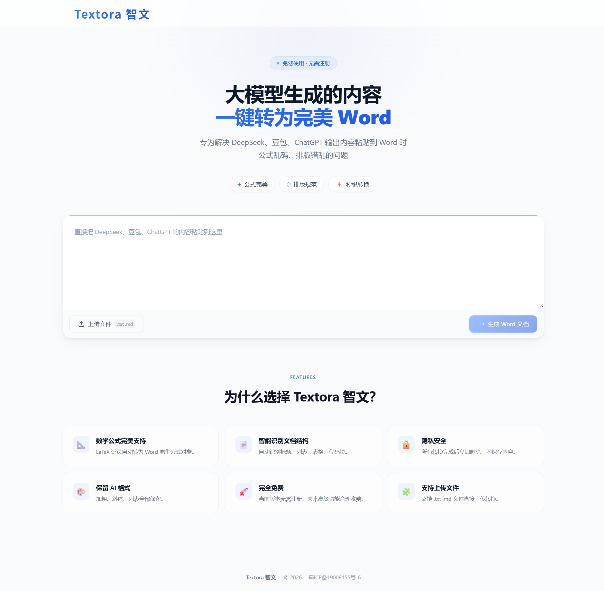

# Textora 智文 ⭐

> **Markdown 转 Word** 专业工具 | AI 生成内容一键转换，解决公式乱码、代码格式、表格排版问题

## 🌟 功能特点

- ✅ **完美支持 DeepSeek、豆包、ChatGPT** 等 AI 输出的 Markdown 格式转换
- ✅ **Markdown 公式转 Word**：自动将 LaTeX 公式转换为 Word 原生公式，彻底解决公式乱码
- ✅ **代码高亮保留**：Markdown 代码块完美转换，格式完整，语法高亮清晰
- ✅ **Markdown 表格转 Word**：自动优化表格样式，排版完美
- ✅ **隐私安全**：转换过程不上传服务器，本地处理，数据安全

## 🚀 使用方法

1. 访问 https://textora.cn
2. 上传 .md 文件或粘贴 Markdown 内容
3. 一键下载完美 Word 文档

## 📖 教程文档

- [DeepSeek Markdown 转 Word 完整教程](./docs/deepseek-tutorial.md)

## 🎯 适用场景

- **学术写作**：AI 生成论文 Markdown 草稿，快速转换为 Word 正式文档
- **技术文档**：Markdown 格式的技术文档，完美转换为 Word
- **商业报告**：Markdown 表格自动优化，节省排版时间
- **学习笔记**：Markdown 公式和代码块完整保留，方便复习

## 💡 核心优势

| 功能 | 传统方式 | Textora 智文 |
|------|----------|--------------|
| 公式转换 | 手动调整，耗时费力 | 一键转换，自动识别 |
| 代码格式 | 复制粘贴，格式丢失 | 完美保留语法高亮 |
| 表格排版 | 逐列调整 | 自动优化样式 |
| 隐私保护 | 需上传到第三方 | 本地处理，零泄露 |

## 🔍 关键词

Markdown 转 Word、Markdown to Word、AI 内容转换、公式乱码解决、代码格式保留、表格排版优化、DeepSeek 转 Word、豆包转 Word、ChatGPT 转 Word

## 🤝 贡献与反馈

欢迎在 [Issues](../../issues) 中提出建议或报告问题

## 📄 许可证

[MIT License](./LICENSE)

---

⭐ 如果这个工具对你有帮助，欢迎点个 Star！
